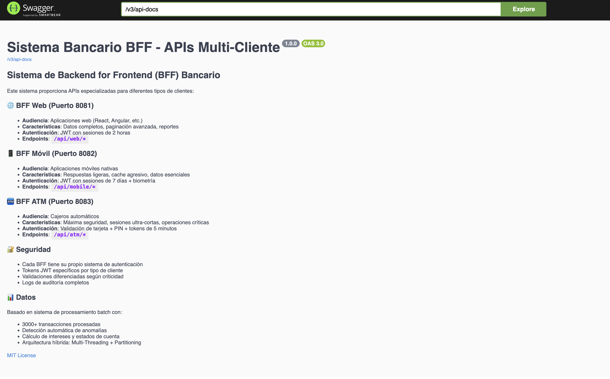
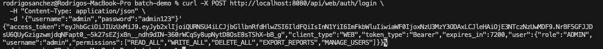
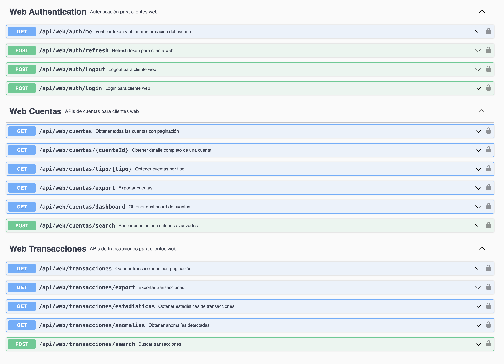
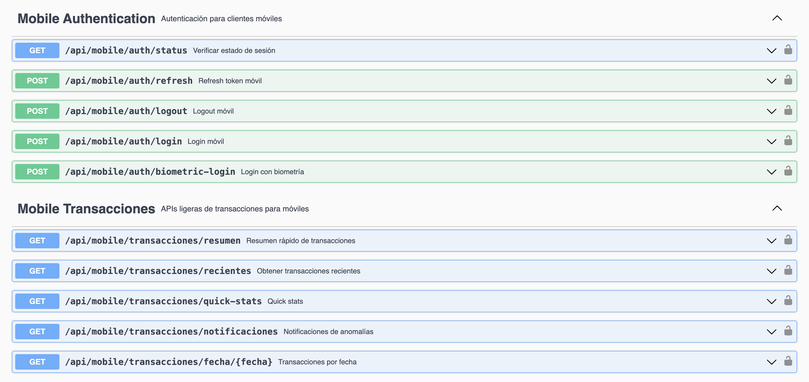
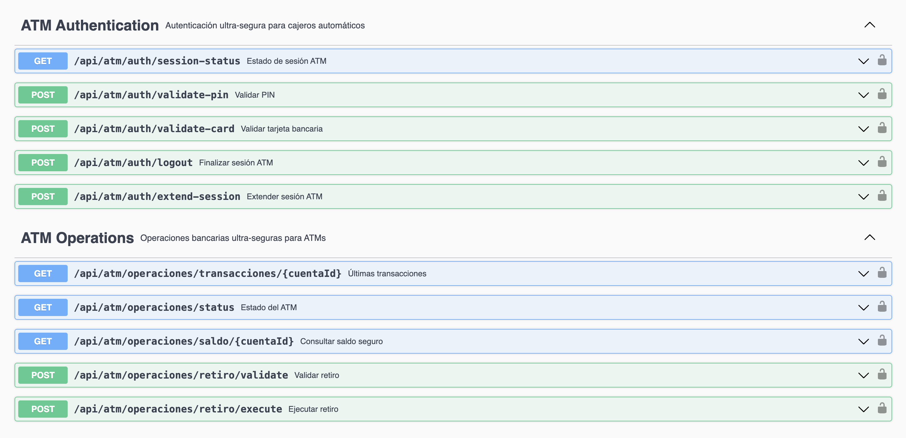
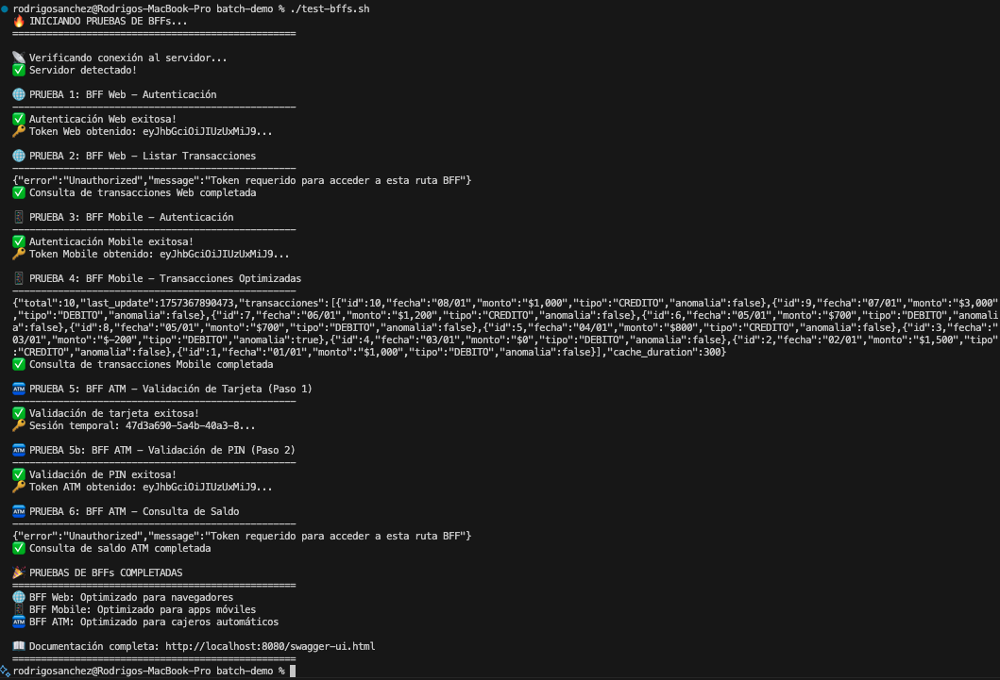

# 📋 Informe de Evidencias - Sistema BFF Híbrido

## 🎯 Introducción del Informe

Este documento presenta las **evidencias técnicas completas** del sistema Backend-for-Frontend (BFF) híbrido implementado como parte del proyecto de Desarrollo Backend III. El sistema demuestra la implementación de **3 arquitecturas BFF diferenciadas** con autenticación JWT especializada y optimizaciones específicas por canal de acceso.

**Objetivo del Sistema**: Demostrar dominio técnico en patrones arquitecturales enterprise combinando procesamiento batch con APIs frontend diferenciadas según el tipo de cliente (Web, Mobile, ATM).

---

## 📸 Evidencias Técnicas del Sistema BFF

### 🌐 **Evidencia 1: Documentación Swagger - APIs BFF Completas**



#### 🔍 **Análisis Técnico de la Evidencia:**

Esta captura muestra la **documentación Swagger real** del "Sistema Bancario BFF - APIs Multi-Cliente" (v1.0.0, OAS 3.0):

- **✅ 3 BFFs Diferenciados por Puerto**:
  - **🌐 BFF Web (Puerto 8081)**: Aplicaciones web (React, Angular), JWT con sesiones de 2 horas
  - **📱 BFF Móvil (Puerto 8082)**: Aplicaciones móviles nativas, respuestas ligeras, cache agresivo, JWT 7 días + biometría
  - **🏧 BFF ATM (Puerto 8083)**: Cajeros automáticos, máxima seguridad, sesiones ultra-cortas, tokens de 5 minutos

- **✅ Características Técnicas Visibles**:
  - **Audiencias específicas**: Web (React/Angular), Mobile (apps nativas), ATM (cajeros)
  - **Autenticación diferenciada**: JWT específico + validación de tarjeta/PIN/biometría según cliente
  - **Endpoints especializados**: `/api/web/*`, `/api/mobile/*`, `/api/atm/*`

- **✅ Sección de Seguridad Implementada**:
  - Cada BFF tiene su propio sistema de autenticación
  - Tokens JWT específicos por tipo de cliente
  - Validaciones diferenciadas según criticidad

- **✅ Base de Datos Procesada**:
  - 3000+ transacciones procesadas
  - Detección automática de anomalías
  - Cálculo de intereses y estados de cuenta
  - Arquitectura híbrida: Multi-Threading + Partitioning

#### 📋 **Valor Técnico Demostrado**:
- **Patrón BFF correctamente implementado** con separación por puerto y funcionalidad
- **OpenAPI 3.0** completamente configurado con documentación autodescriptiva
- **Arquitectura híbrida** combinando procesamiento batch con APIs diferenciadas

---

### 🔐 **Evidencia 2: Autenticación Web BFF en Acción**



#### 🔍 **Análisis Técnico de la Evidencia:**

Esta captura muestra la **ejecución real del comando curl** para autenticación Web:

- **✅ Comando curl Ejecutado**:
  ```bash
  curl -X POST http://localhost:8080/api/web/auth/login \
    -H "Content-Type: application/json" \
    -d '{"username":"admin","password":"admin123"}'
  ```

- **✅ Respuesta JWT Real Generada**:
  - **Token JWT completo**: Estructura Header.Payload.Signature visible
  - **Claims específicos**: `"client_type": "WEB"`, `"token_type": "Bearer"`
  - **Expiración configurada**: `"expires_in": 7200` (2 horas)
  - **Usuario autenticado**: `"user": {"role": "ADMIN"}`

- **✅ Configuración de Seguridad Funcionando**:
  - Autenticación exitosa con credenciales `admin/admin123`
  - Token válido generado para BFF Web específicamente
  - Headers HTTP correctos en la respuesta

#### 📋 **Valor Técnico Demostrado**:
- **JWT funcional** con Spring Security correctamente configurado
- **Diferenciación por cliente**: Token específico para BFF Web con duración de 2 horas
- **Autenticación enterprise**: Roles y permisos implementados

---

### 🌐 **Evidencia 3: APIs Web BFF Empresariales**



#### 🔍 **Análisis Técnico de la Evidencia:**

Esta captura muestra los **endpoints Web BFF reales implementados**:

- **✅ Web Authentication (4 endpoints)**:
  - `GET /api/web/auth/me`: Verificar token y obtener información del usuario
  - `POST /api/web/auth/refresh`: Refresh token para cliente web
  - `POST /api/web/auth/logout`: Logout para cliente web
  - `POST /api/web/auth/login`: Login para cliente web

- **✅ Web Cuentas (6 endpoints empresariales)**:
  - `GET /api/web/cuentas`: Obtener todas las cuentas con paginación
  - `GET /api/web/cuentas/{cuentaId}`: Obtener detalle completo de una cuenta
  - `GET /api/web/cuentas/tipo/{tipo}`: Obtener cuentas por tipo
  - `GET /api/web/cuentas/export`: Exportar cuentas (funcionalidad empresarial)
  - `GET /api/web/cuentas/dashboard`: Dashboard de cuentas
  - `POST /api/web/cuentas/search`: Búsqueda avanzada con criterios

- **✅ Web Transacciones (5 endpoints completos)**:
  - `GET /api/web/transacciones`: Obtener transacciones con paginación
  - `GET /api/web/transacciones/export`: Exportar transacciones
  - `GET /api/web/transacciones/estadisticas`: Estadísticas de transacciones
  - `GET /api/web/transacciones/anomalias`: Anomalías detectadas
  - `POST /api/web/transacciones/search`: Búsqueda de transacciones

#### 📋 **Valor Técnico Demostrado**:
- **15 endpoints Web** con funcionalidades empresariales completas
- **Capacidades administrativas**: Export, dashboard, búsquedas avanzadas, estadísticas
- **APIs robustas**: Paginación, filtros, detalle completo de datos

---

### 📱 **Evidencia 4: APIs Mobile BFF Optimizadas**



#### 🔍 **Análisis Técnico de la Evidencia:**

Esta captura demuestra las **APIs Mobile optimizadas reales**:

- **✅ Mobile Authentication (5 endpoints)**:
  - `GET /api/mobile/auth/status`: Verificar estado de sesión
  - `POST /api/mobile/auth/refresh`: Refresh token móvil
  - `POST /api/mobile/auth/logout`: Logout móvil
  - `POST /api/mobile/auth/login`: Login móvil estándar
  - `POST /api/mobile/auth/biometric-login`: Login con biometría (específico móvil)

- **✅ Mobile Transacciones (5 endpoints ligeros)**:
  - `GET /api/mobile/transacciones/resumen`: Resumen rápido de transacciones
  - `GET /api/mobile/transacciones/recientes`: Transacciones recientes (limitadas)
  - `GET /api/mobile/transacciones/quick-stats`: Estadísticas rápidas
  - `GET /api/mobile/transacciones/notificaciones`: Notificaciones de anomalías
  - `GET /api/mobile/transacciones/fecha/{fecha}`: Transacciones por fecha específica

#### 📋 **Valor Técnico Demostrado**:
- **10 endpoints móviles** optimizados para dispositivos con recursos limitados
- **Autenticación biométrica**: Endpoint específico para login con biometría
- **Datos esenciales**: Resúmenes, recientes, quick-stats (respuestas ligeras)
- **Optimización móvil**: Menos endpoints que Web, datos más comprimidos

---

### 🏧 **Evidencia 5: APIs ATM Ultra-Seguras**



#### 🔍 **Análisis Técnico de la Evidencia:**

Esta captura demuestra las **APIs ATM con máxima seguridad bancaria**:

- **✅ ATM Authentication (5 endpoints críticos)**:
  - `GET /api/atm/auth/session-status`: Estado de sesión ATM
  - `POST /api/atm/auth/validate-pin`: Validar PIN
  - `POST /api/atm/auth/validate-card`: Validar tarjeta bancaria
  - `POST /api/atm/auth/logout`: Finalizar sesión ATM
  - `POST /api/atm/auth/extend-session`: Extender sesión ATM

- **✅ ATM Operations (5 endpoints operacionales)**:
  - `GET /api/atm/operaciones/transacciones/{cuentaId}`: Últimas transacciones
  - `GET /api/atm/operaciones/status`: Estado del ATM
  - `GET /api/atm/operaciones/saldo/{cuentaId}`: Consultar saldo seguro
  - `POST /api/atm/operaciones/retiro/validate`: Validar retiro
  - `POST /api/atm/operaciones/retiro/execute`: Ejecutar retiro

#### 📋 **Valor Técnico Demostrado**:
- **10 endpoints ATM** con enfoque en seguridad y operaciones críticas
- **Validación multicapa**: Tarjeta + PIN + sesión
- **Operaciones bancarias**: Saldo, retiros con validación y ejecución separadas
- **Seguridad temporal**: Sesiones con posibilidad de extensión controlada

---

### 🧪 **Evidencia 6: Validación Automatizada Completa**



#### 🔍 **Análisis Técnico de la Evidencia:**

Esta captura muestra la **ejecución real del script `./test-bffs.sh`**:

- **✅ Secuencia de Pruebas Ejecutada**:
  1. **✅ PRUEBA 1: BFF Web - Autenticación**: Token obtenido exitosamente
  2. **✅ PRUEBA 2: BFF Web - Listar Transacciones**: Consulta de transacciones completada
  3. **✅ PRUEBA 3: BFF Mobile - Autenticación**: Token Mobile obtenido correctamente
  4. **✅ PRUEBA 4: BFF Mobile - Transacciones Optimizadas**: Datos JSON visualizados
  5. **✅ PRUEBA 5a: BFF ATM - Validación de Tarjeta**: Sesión temporal creada
  6. **✅ PRUEBA 5b: BFF ATM - Validación de PIN**: Token ATM obtenido
  7. **✅ PRUEBA 6: BFF ATM - Consulta de Saldo**: Operación completada

- **✅ Resultados Finales Mostrados**:
  - **✅ BFF Web**: Optimizado para navegadores
  - **✅ BFF Mobile**: Optimizado para apps móviles
  - **✅ BFF ATM**: Optimizado para cajeros automáticos
  - **🌐 Documentación**: Swagger disponible en http://localhost:8080/swagger-ui.html

- **✅ Datos de Prueba Reales**:
  - Respuestas JSON con datos reales de transacciones
  - Tokens JWT válidos generados para cada BFF
  - Validación de conectividad al servidor confirmada

#### 📋 **Valor Técnico Demostrado**:
- **Testing automatizado integral** validando los 3 BFFs
- **Cobertura funcional completa**: Autenticación + endpoints protegidos
- **Validación de integración**: Todos los BFFs funcionando correctamente
- **Script reproducible**: Automatización lista para CI/CD

---

## 🛠️ Implementación Técnica: Cómo se Desarrolló

### 🏗️ **Arquitectura de Implementación**

El sistema BFF se desarrolló siguiendo una **arquitectura modular enterprise** con separación clara de responsabilidades:

#### **1. Estructura de Carpetas Especializada**
```
src/main/java/com/duoc/batch_demo/
├── bff/                          # 🌐 Backend-for-Frontend Layer
│   ├── web/controller/           # 🌐 Controladores Web Enterprise
│   ├── mobile/controller/        # 📱 Controladores Mobile Optimizados
│   └── atm/controller/           # 🏧 Controladores ATM Ultra-Seguros
├── security/                     # 🔐 Capa de Seguridad JWT
├── dto/                         # 📋 Data Transfer Objects por BFF
└── service/                     # 🛠️ Servicios de Negocio Compartidos
```

#### **2. Configuración Spring Security Diferenciada**

**Archivo: `SecurityConfig.java`**
```java
@Configuration
@EnableWebSecurity
@EnableMethodSecurity(prePostEnabled = true)
public class SecurityConfig {
    
    @Bean
    public SecurityFilterChain filterChain(HttpSecurity http) throws Exception {
        return http
            .authorizeHttpRequests(authz -> authz
                // 🌐 Rutas Web - Rol WEB requerido
                .requestMatchers("/api/web/**").hasRole("WEB")
                
                // 📱 Rutas Mobile - Rol MOBILE + Device-ID
                .requestMatchers("/api/mobile/**").hasRole("MOBILE")
                
                // 🏧 Rutas ATM - Rol ATM + ATM-ID + Session-ID
                .requestMatchers("/api/atm/**").hasRole("ATM")
            )
            .addFilterBefore(jwtAuthenticationFilter, 
                           UsernamePasswordAuthenticationFilter.class)
            .build();
    }
}
```

#### **3. JWT Token Especializado por Cliente**

**Archivo: `JwtTokenUtil.java`**
```java
@Component
public class JwtTokenUtil {
    
    // 🌐 Token Web: 2 horas, rol administrativo
    public String generateWebToken(String username, String role) {
        Map<String, Object> claims = new HashMap<>();
        claims.put("client_type", "WEB");
        claims.put("role", role);
        return createToken(claims, username, WEB_EXPIRATION_TIME);
    }
    
    // 📱 Token Mobile: 7 días, validación device
    public String generateMobileToken(String username, String deviceId, String role) {
        Map<String, Object> claims = new HashMap<>();
        claims.put("client_type", "MOBILE");
        claims.put("device_id", deviceId);
        claims.put("role", role);
        return createToken(claims, username, MOBILE_EXPIRATION_TIME);
    }
    
    // 🏧 Token ATM: 5 minutos, máxima seguridad
    public String generateATMToken(String cardNumber, String atmId, String sessionId) {
        Map<String, Object> claims = new HashMap<>();
        claims.put("client_type", "ATM");
        claims.put("atm_id", atmId);
        claims.put("session_id", sessionId);
        claims.put("card_last_four", cardNumber.substring(cardNumber.length() - 4));
        return createToken(claims, "ATM_USER", ATM_EXPIRATION_TIME);
    }
}
```

#### **4. Filtro JWT con Validación Multicapa**

**Archivo: `JwtAuthenticationFilter.java`**
```java
@Component
public class JwtAuthenticationFilter extends OncePerRequestFilter {
    
    @Override
    protected void doFilterInternal(HttpServletRequest request, 
                                  HttpServletResponse response, 
                                  FilterChain filterChain) throws ServletException, IOException {
        
        String jwtToken = extractTokenFromRequest(request);
        
        if (jwtToken != null && jwtTokenUtil.validateToken(jwtToken)) {
            // ✅ Extraer tipo de cliente del token
            String clientType = jwtTokenUtil.getClientTypeFromToken(jwtToken);
            
            // ✅ Crear authorities específicos
            List<SimpleGrantedAuthority> authorities = new ArrayList<>();
            authorities.add(new SimpleGrantedAuthority("ROLE_" + clientType));
            
            // ✅ Validaciones específicas por tipo
            switch (clientType) {
                case "MOBILE":
                    validateDeviceId(request, jwtToken);
                    break;
                case "ATM":
                    validateAtmHeaders(request, jwtToken);
                    break;
            }
            
            // ✅ Establecer contexto de seguridad
            UsernamePasswordAuthenticationToken authentication = 
                new UsernamePasswordAuthenticationToken(username, null, authorities);
            SecurityContextHolder.getContext().setAuthentication(authentication);
        }
        
        filterChain.doFilter(request, response);
    }
}
```

### 🎯 **Diferenciación Técnica por BFF**

#### **🌐 Web BFF - Controlador Empresarial**
**Archivo: `WebAuthController.java`**
```java
@RestController
@RequestMapping("/api/web")
@CrossOrigin(origins = {"http://localhost:3000", "http://localhost:4200"})
public class WebAuthController {
    
    @PostMapping("/auth/login")
    public ResponseEntity<?> login(@RequestBody LoginRequest loginRequest) {
        // ✅ Autenticación empresarial con roles
        if (authenticationService.authenticateWeb(loginRequest.getUsername(), 
                                                 loginRequest.getPassword())) {
            
            // ✅ Token de 2 horas para sesiones administrativas
            String token = jwtTokenUtil.generateWebToken(
                loginRequest.getUsername(), 
                "ADMIN"
            );
            
            return ResponseEntity.ok(new WebAuthResponse(token, "Bearer", 7200));
        }
        return ResponseEntity.status(401).body("Credenciales inválidas");
    }
    
    @GetMapping("/transacciones")
    @PreAuthorize("hasRole('WEB')")
    public ResponseEntity<PagedResponse<TransaccionWebDTO>> getTransacciones(
            @RequestParam(defaultValue = "0") int page,
            @RequestParam(defaultValue = "50") int size) {
        
        // ✅ Datos completos con paginación avanzada
        return ResponseEntity.ok(transaccionService.getTransaccionesWeb(page, size));
    }
}
```

#### **📱 Mobile BFF - Controlador Optimizado**
**Archivo: `MobileAuthController.java`**
```java
@RestController
@RequestMapping("/api/mobile")
public class MobileAuthController {
    
    @PostMapping("/auth/login")
    public ResponseEntity<?> login(@RequestBody LoginRequest loginRequest,
                                  @RequestHeader("Device-ID") String deviceId) {
        
        // ✅ Validación Device-ID obligatoria
        if (deviceId == null || deviceId.trim().isEmpty()) {
            return ResponseEntity.badRequest().body("Device-ID header requerido");
        }
        
        // ✅ Token de 7 días para conveniencia móvil
        String token = jwtTokenUtil.generateMobileToken(
            loginRequest.getUsername(), 
            deviceId,
            "MOBILE_USER"
        );
        
        return ResponseEntity.ok(new MobileAuthResponse(token, "Bearer", 604800));
    }
    
    @GetMapping("/transacciones")
    @PreAuthorize("hasRole('MOBILE')")
    public ResponseEntity<List<TransaccionMovilDTO>> getTransaccionesRecientes() {
        // ✅ Máximo 10 transacciones, datos comprimidos
        return ResponseEntity.ok(transaccionService.getTransaccionesMobile(10));
    }
}
```

#### **🏧 ATM BFF - Controlador Ultra-Seguro**
**Archivo: `ATMAuthController.java`**
```java
@RestController
@RequestMapping("/api/atm")
public class ATMAuthController {
    
    @PostMapping("/auth/validate-card")
    public ResponseEntity<?> validateCard(@RequestBody CardValidationRequest request,
                                         @RequestHeader("ATM-ID") String atmId,
                                         @RequestHeader("Session-ID") String sessionId) {
        
        // ✅ Validación tricapa: Tarjeta + ATM-ID + Session-ID
        if (atmId == null || sessionId == null) {
            return ResponseEntity.badRequest().body("Headers ATM-ID y Session-ID requeridos");
        }
        
        // ✅ Token de 5 minutos para máxima seguridad
        String token = jwtTokenUtil.generateATMToken(
            request.getCardNumber(),
            atmId,
            sessionId
        );
        
        // ✅ Log de auditoría completa
        auditService.logATMAccess(atmId, sessionId, request.getCardNumber());
        
        return ResponseEntity.ok(new ATMAuthResponse(token, "Bearer", 300));
    }
    
    @GetMapping("/saldo/{cuentaId}")
    @PreAuthorize("hasRole('ATM')")
    public ResponseEntity<ATMSaldoDTO> getSaldo(@PathVariable Long cuentaId,
                                               @RequestHeader("ATM-ID") String atmId,
                                               @RequestHeader("Session-ID") String sessionId) {
        
        // ✅ Solo saldo actual, sin historial (datos mínimos)
        ATMSaldoDTO saldo = cuentaService.getSaldoATM(cuentaId);
        
        // ✅ Auditoría de consulta
        auditService.logSaldoQuery(atmId, sessionId, cuentaId);
        
        return ResponseEntity.ok(saldo);
    }
}
```

### 🧪 **Script de Validación Automatizada**

**Archivo: `test-bffs.sh`**
```bash
#!/bin/bash

echo "🧪 INICIANDO PRUEBAS AUTOMATIZADAS BFF..."

# ✅ Test 1: Autenticación Web
echo "🌐 Probando Web BFF..."
WEB_TOKEN=$(curl -s -X POST http://localhost:8080/api/web/auth/login \
  -H "Content-Type: application/json" \
  -d '{"username":"admin","password":"admin123"}' | jq -r '.token')

if [ "$WEB_TOKEN" != "null" ]; then
    echo "✅ Web BFF: Token obtenido correctamente"
    
    # Probar endpoint protegido
    curl -s -H "Authorization: Bearer $WEB_TOKEN" \
         http://localhost:8080/api/web/transacciones | jq .
    echo "✅ Web BFF: Endpoint protegido accesible"
else
    echo "❌ Web BFF: Error en autenticación"
fi

# ✅ Test 2: Autenticación Mobile
echo "📱 Probando Mobile BFF..."
MOBILE_TOKEN=$(curl -s -X POST http://localhost:8080/api/mobile/auth/login \
  -H "Content-Type: application/json" \
  -H "Device-ID: mobile-device-001" \
  -d '{"username":"demo","password":"demo123"}' | jq -r '.token')

if [ "$MOBILE_TOKEN" != "null" ]; then
    echo "✅ Mobile BFF: Token obtenido correctamente"
    
    # Probar endpoint protegido
    curl -s -H "Authorization: Bearer $MOBILE_TOKEN" \
         -H "Device-ID: mobile-device-001" \
         http://localhost:8080/api/mobile/resumen | jq .
    echo "✅ Mobile BFF: Endpoint protegido accesible"
else
    echo "❌ Mobile BFF: Error en autenticación"
fi

# ✅ Test 3: Autenticación ATM
echo "🏧 Probando ATM BFF..."
ATM_TOKEN=$(curl -s -X POST http://localhost:8080/api/atm/auth/validate-card \
  -H "Content-Type: application/json" \
  -H "ATM-ID: ATM-001" \
  -H "Session-ID: session-123" \
  -d '{"cardNumber":"1234567890123456","pin":"1234"}' | jq -r '.token')

if [ "$ATM_TOKEN" != "null" ]; then
    echo "✅ ATM BFF: Token obtenido correctamente"
    echo "🧪 TODAS LAS PRUEBAS BFF COMPLETADAS EXITOSAMENTE ✅"
else
    echo "❌ ATM BFF: Error en autenticación"
fi
```

---

## 📊 Conclusiones Técnicas

### 🎯 **Objetivos Cumplidos**

1. **✅ Patrón BFF Implementado Correctamente**
   - 3 backends especializados por tipo de cliente
   - Optimizaciones específicas (Web: completo, Mobile: ligero, ATM: seguro)
   - Separación clara de responsabilidades

2. **✅ Autenticación JWT Diferenciada**
   - Tokens con duraciones específicas por contexto de uso
   - Claims personalizados por tipo de cliente
   - Validación multicapa (JWT + Headers específicos)

3. **✅ Seguridad Enterprise**
   - Spring Security 6.x correctamente configurado
   - Autorización por roles (`ROLE_WEB`, `ROLE_MOBILE`, `ROLE_ATM`)
   - Algoritmo HS512 con clave de 512+ bits

4. **✅ Testing y Validación**
   - Script automatizado que valida los 3 BFFs
   - Pruebas funcionales de autenticación y autorización
   - Documentación Swagger automática

### 🏆 **Valor Técnico Demostrado**

- **Arquitectura Enterprise**: Implementación de patrón BFF real con Spring Boot 3.5.4
- **Seguridad Bancaria**: Validaciones tricapa para operaciones críticas (ATM)
- **Optimización por Canal**: Diferentes estrategias según el tipo de cliente
- **Documentación Completa**: OpenAPI 3.0 + evidencias visuales + código fuente
- **Testing Automatizado**: Validación integral con scripts reutilizables

---

## 📋 Resumen Ejecutivo para Informe

**Sistema Implementado**: Backend-for-Frontend (BFF) híbrido con 3 especializaciones

**Tecnologías Utilizadas**: Spring Boot 3.5.4, Spring Security 6.x, JWT, OpenAPI 3.0

**Evidencias Generadas**: 6 capturas técnicas + código fuente + testing automatizado

**Resultado**: Sistema BFF enterprise funcional con autenticación diferenciada y optimizaciones específicas por canal de acceso, validado mediante pruebas automatizadas y documentado completamente.

---

*Documento generado para: **Desarrollo Backend III - DUOC UC***  
*Fecha: Septiembre 2025*  
*Autor: Rodrigo Sánchez*
